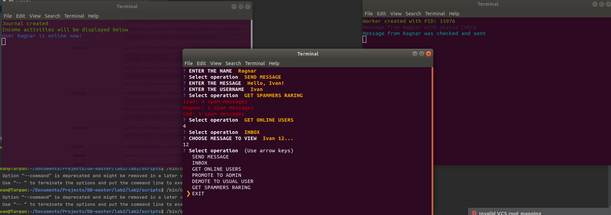
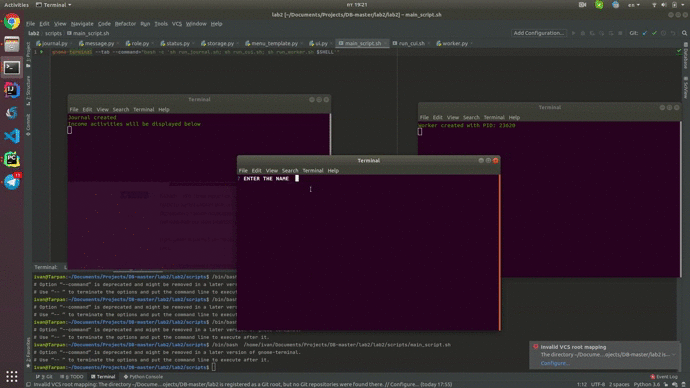

# Ільїнський Іван, КП-73

# Лабораторна робота 2: Практичне використання сервера Redis

## Запуск:
Виконання скрипта *main_script.sh*, що знаходиться у папці *scripts* запустить одночасно всі три сервіси у режимі __owner__ (щоб змінити режим доступу — необхідно у файлі *run_cui.sh* у строці
`python3 start_ui.py [access_level]` замість `[access_level]` вказати бажаний режим доступу: admin або user і виконати скрипт знову.

## Результати роботи:
Робота журналу активностей та можливості користувача в ролі Власника

___
Детальне медіа-демо роботи програми

